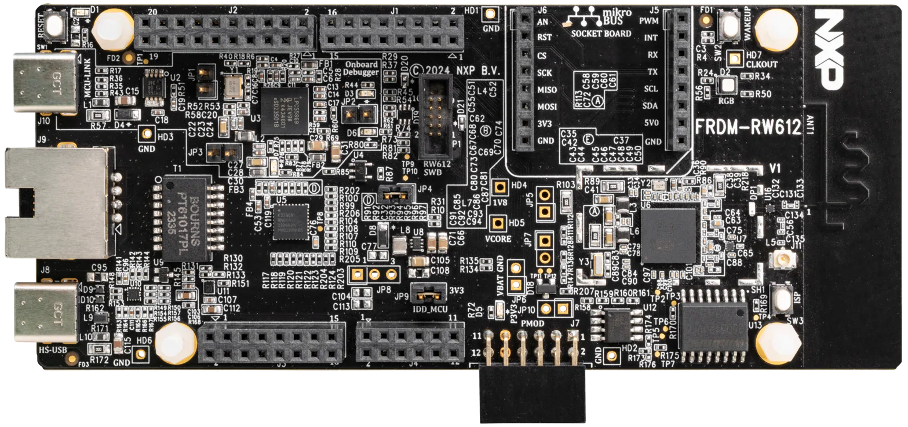
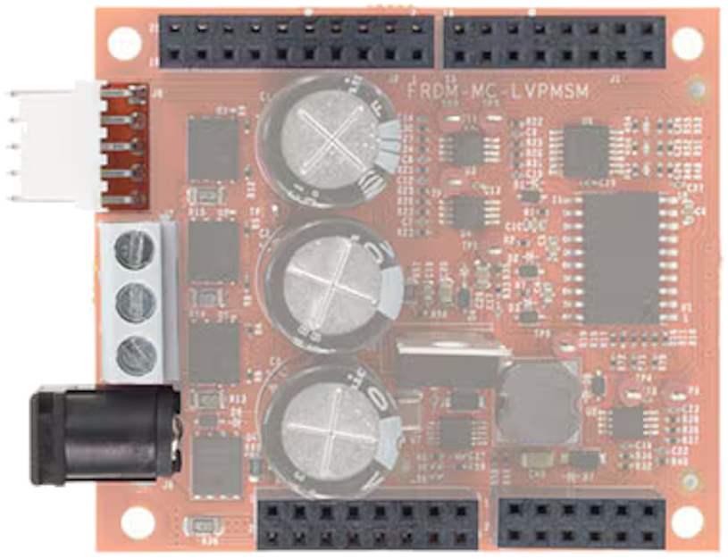
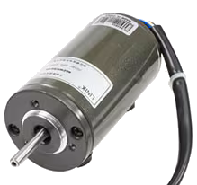
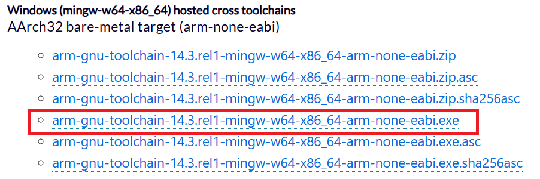
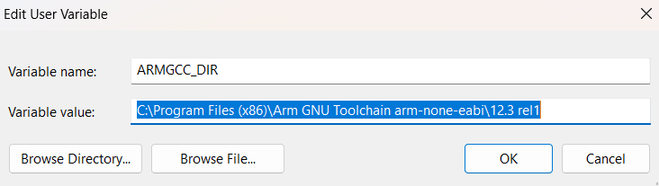
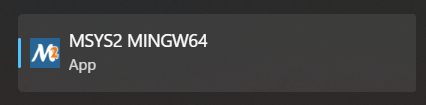
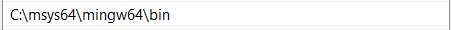
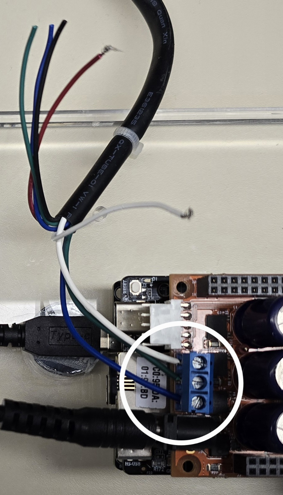
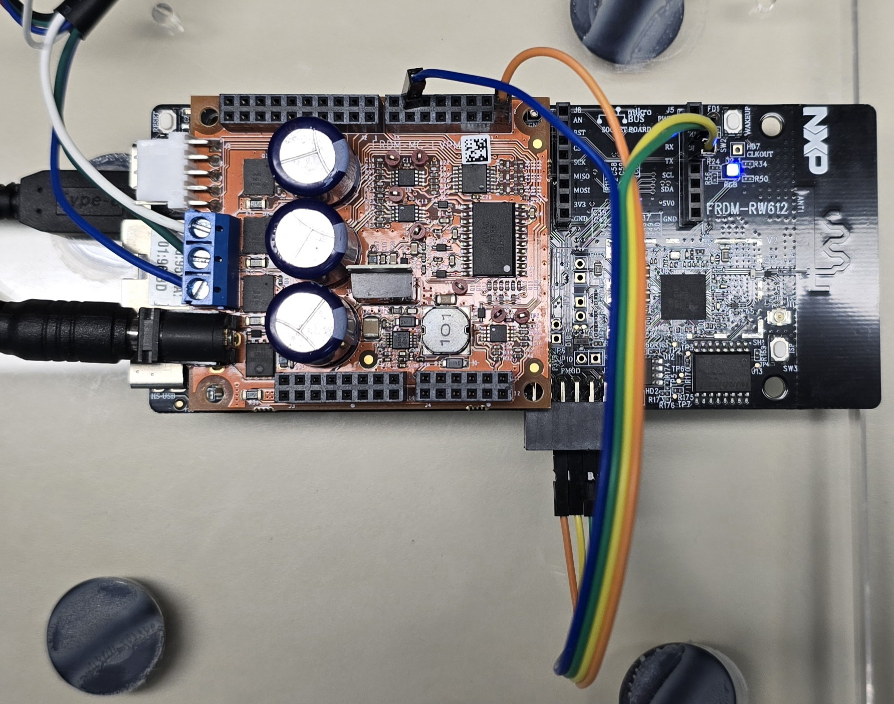
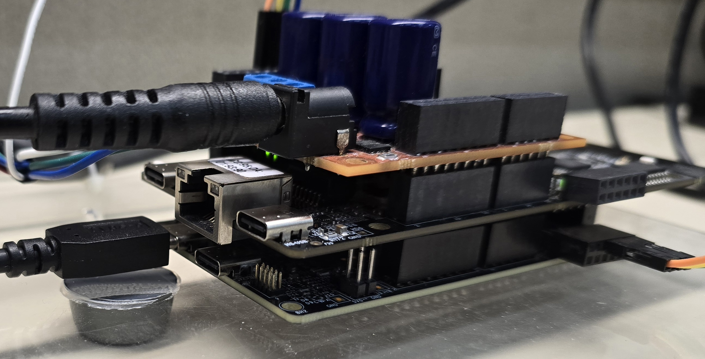

# NXP Application Code Hub
[](https://www.nxp.com)

## Wireless Co-Processor Enabled Motor Control
This demo showcases a distributed Network Co‑Processor (NCP) architecture for motor control applications using the FRDM‑MCXA156 as the main control, running motor control algorithms and controlling the high‑performance wireless co‑processor FRDM-RW612.

In this setup, FRDM‑MCXA156 executes the real‑time PMSM motor‑control sensorless algorithms, while the FRDM‑RW612 manages all wireless processing, acting as a Wi‑Fi access point, socket‑based communication with an Android application, this enable seamless wireless UI for monitoring and interact with the motor‑control system.

This architecture demonstrates how FRDM boards can be combined to create interactive smart nodes, enabling real‑time control, connectivity, and system expansion through a clean partition of responsibilities between processing and communication.

#### Boards: FRDM-MCXA156, FRDM-RW612
#### Categories: Industrial, Motor Control, Wireless Connectivity, RTOS
#### Peripherals: ADC, GPIO, PWM, SPI, TIMER, UART
#### Toolchains: VS Code

## Table of Contents
1. [Software](#step1)
2. [Hardware](#step2)
3. [Setup](#step3)
4. [Results](#step4)
7. [Release Notes](#step5)

## 1. Software<a name="step1"></a>
- [VSCode (1.107.0)](https://code.visualstudio.com/)
- [MCUXpresso for VSCode extension (25.11.16)](https://marketplace.visualstudio.com/items?itemName=NXPSemiconductors.mcuxpresso)
- [SDK version 25.12.0](https://github.com/nxp-mcuxpresso/mcuxsdk-core)

## 2. Hardware<a name="step2"></a>
- [FRDM-MCXA156](https://www.nxp.com/design/design-center/development-boards-and-designs/FRDM-MCXA156)
[<p align="center"></p>](./images/FRDM-MCXA156.png)
- [FRDM-RW612](https://www.nxp.com/design/design-center/development-boards-and-designs/FRDM-RW612)
[<p align="center"></p>](./images/FRDM-RW612.png)
- [FRDM-MC-LVPMSM](https://www.nxp.com/design/design-center/development-boards-and-designs/general-purpose-mcus/nxp-frdm-development-platform-for-low-voltage-3-phase-pmsm-motor-control:FRDM-MC-LVPMSM)
[<p align="center"></p>](./images/FRDM-MC-LVPMSM.png)
- [FRDM-MC-LVMTR](https://www.nxp.com/design/design-center/development-boards-and-designs/FRDM-MC-LVMTR)
[<p align="center"></p>](./images/FRDM-MC-LVMTR.png)
- Power supply 24v 5 amp
- USB-C Cable
- Computer
- 4 proto wires

## 3. Setup<a name="step3"></a>

### 3.1 Prepare before import code
1. [Install VSCode.](https://www.nxp.com/design/design-center/training/TIP-GETTING-STARTED-WITH-MCUXPRESSO-FOR-VS-CODE)
2. [Install MCUXpresso for VSCode extension.](https://www.nxp.com/design/design-center/training/TIP-GETTING-STARTED-WITH-MCUXPRESSO-FOR-VS-CODE)
3. [Import SDK repository (Import could be take about an hour).](https://www.nxp.com/design/design-center/training/TIP-GETTING-STARTED-WITH-MCUXPRESSO-FOR-VS-CODE)
    - Open MCUXpresso for VSCode extension.
    - In Quick Start Panel window click in Import Repository.
    - Select MCUXpresso SDK repository.
    - Select main revision or specific if is needed.
    - Select save location.
    - Click import.
    - Import could be take about an hour.

### 3.2 Import example from Application Code Hub
1. Open MCUXpresso for VSCode extension.
2. In Quick Start Panel window click in Application Code Hub.
3. In Search text field, type the name of desired example.
4. Select example, put some name for save the example, and the directory where the example will be saved.
5. Click in Import Project and wait few seconds.

### 3.3 Prepare FRDM-RW612
1. [Download Arm GNU Toolchain.](https://developer.arm.com/downloads/-/arm-gnu-toolchain-downloads)
[<p align="center"></p>](./images/ARMToolchain.png)
2. Add Toolchain to enviroment variable.
[<p align="center"></p>](./images/ARMVariable.png)
3. [Install MinGW-w64 toolchain (Ignore prerequisites)](https://code.visualstudio.com/docs/cpp/config-mingw)
4. Open MSYS2 MINGW64 shell
[<p align="center"></p>](./images/MinGW64.png)
5. Type next commands
```
pacman -Syu
pacman -Su
pacman -S mingw-w64-x86_64-cmake mingw-w64-x86_64-make
pacman -S mingw-w64-x86_64-ninja
```
6. Add mingw to path enviroment variable
[<p align="center"></p>](./images/EnviromentVariables.png)
7. For test instalation, open windows shell and type next command
```
cmake --version
```
6. [Download MCUXpresso SDK of FRDM-RW612 (25.06.00).](https://mcuxpresso.nxp.com/select)
7. Extract files of SDK.
8. Open SDK folder and go to /boards/frdmrw612/ncp_examples/ncp_device.
9. Open app_config (CMake file).
10. Set next configurations and save file.

```
# ncp coex applications
# Enable WIFI, BLE or OT functions
set(CONFIG_NCP_WIFI           1)
set(CONFIG_NCP_BLE            1)
set(CONFIG_NCP_OT             0)
# Select the ncp interface to use
set(CONFIG_NCP_UART           0)
set(CONFIG_NCP_SPI            1)
set(CONFIG_NCP_USB            0)
set(CONFIG_NCP_SDIO           0)
# Eanble wpa supplicant, only valid when WIFI is enabled
set(CONFIG_WPA_SUPPLICANT     0)
```

11. Open ncp_tlv_adapter.h
12. Set CONFIG_NCP_USE_ENCRYPT to 0.
```
#define CONFIG_NCP_USE_ENCRYPT         0
```
13. Then open armgcc folder and do double click in build_flash_debug (Batch file).
14. Please wait while CMD window is open.
15. Open flash_debug folder; if ncp_device.elf file exist, build was successfully.
16. Save this path, it is going to be used in other side.

### 3.4 Prepare FRDM-MCXA156
1. Place and weld PMOD connector (J7)

### 3.5 Prepare FRDM-MC-LVPMSM
1. Connect Motor to FRDM-MC-LVPMSM 
[<p align="center"></p>](./images/MotorConnection.jpg)

### 3.6 Plug boards
1. Plug FRDM-RW612 on FRDM-MCXA156
2. Plug FRDM-MC-LVPMSM on FRDM-RW612
[<p align="center"></p>](./images/PlugBoardsSideView.jpg)

### 3.7 Connect SPI wires

| PIN  | FRDM-MCXA156 | FRDM-RW612 |
|:----:|:------------:|:----------:|
| MOSI | J7 pin 3     | J5 pin 3   |
| MISO | J7 pin 5     | J5 pin 4   |
| SCK  | J7 pin 7     | J1 pin 1   |
| CS   | J7 pin 1     | J1 pin 14  |

[<p align="center"></p>](./images/PlugBoardsTopView.jpg)

### 3.8 Flash the FRDM-RW612 Application
1. Connect FRDM-RW612 to computer with USB-C cable in J10.
2. Open J-Link Commander
3. Type next commands
```
1. connect
2. RW612
3. S
4. 4000 (Click accept in emergent window)
5. erase (Wait while board is erasing)
6. loadbin [SDK_path]/boards/frdmrw612/ncp_examples/ncp_device/armgcc/flash_debug/ncp_device.elf 0x0 reset
```
4. Disconnect board
5. Connect board
6. Open terminal with baudrate of 115200
7. Push reset button (SW1) of FRDM-RW612
8. Terminal should print this
```
========================================
NCP device demo
========================================
========================================
Start the spi handshake task
========================================
Initialize NCP config littlefs CLIs
LFS mounted
Initialize WLAN Driver
Wi-Fi cau temperature : 24
STA MAC Address: 00:00:00:00:00:00
baord_type: 2, baord_type mapping:
0----QFN
1----CSP
2----BGA
========================================
app_cb: WLAN: received event 12
========================================
app_cb: WLAN initialized
========================================
mDNS are initialized
========================================
========================================
app_cb: WLAN: received event 16
========================================
app_cb: WLAN: PS_ENTER
========================================
app_cb: WLAN: received event 16
========================================
app_cb: WLAN: PS_ENTER
BLE initialized
========================================

MCU wakeup source 0x0...
```
9. If terminal prints above part, binary was uploaded successfully.

### 3.9 Flash the FRDM-MCXA156 Application
1. Connect FRDM-MCXA156 to computer with USB-C cable in J21.
2. Open MCUXpresso extension in VSCode.
3. Select the project "dn-mc-pmsm-ncp-frdm-mcxa156".
4. Expand project and expand "Project Files" option
5. Open CMakePresets.json
6. Open Windows File Explorer and go to path, see your version of ".venv_3_13"
```
C:/Users/%YourUserName%/.mcuxpressotools/
```
7. Replace version in CMakePresets.json in section of "configurePresets" -> "cacheVariables" -> "Python3_EXECUTABLE"
```
        "Python3_EXECUTABLE": {
          "type": "FILEPATH",
          "value": "$env{ARMGCC_DIR}/../.venv_3_13/Scripts/python.exe"
        }
```
8. Do right click on project and select pristine build and wait about a one minute.
9. Click run (play icon).
10. Please wait a few seconds.
11. Now click stop in center upper button.
12. Click reset in FRDM-RW612 (SW1).

### 3.10 Connect FRDM-MC-LVPMSM
1. Connect 24v power supply to FRDM-MC-LVPMSM.
[<p align="center"></p>](./images/PowerBoardsConnection.jpg)
2. Red LED should stop blink in a few seconds.

### 3.11 Run android application
1. Copy NCP_motor_control.apk (available in project folder) to some android device.
2. Open apk file in android device and select "packet installer" in emergent window.
3. Now connect your android device to wifi network NXP_NCP_Motor_Control
```
SSID:     NXP_NCP_Motor_Control
Password: 0123456789
```
4. Then open Motor Control app from applications screen.
5. Click in Network subscreen.
6. Click in "Connect to server" button.

## 4. Results<a name="step4"></a>
[<p align="center"></p>](./images/Test.webp)

#### Project Metadata

<!----- Boards ----->
[]()
[]()

<!----- Categories ----->
[](https://mcuxpresso.nxp.com/appcodehub?category=industrial)
[](https://mcuxpresso.nxp.com/appcodehub?category=motor_control)
[](https://mcuxpresso.nxp.com/appcodehub?category=wireless_connectivity)
[](https://mcuxpresso.nxp.com/appcodehub?category=rtos)

<!----- Peripherals ----->
[](https://mcuxpresso.nxp.com/appcodehub?peripheral=adc)
[](https://mcuxpresso.nxp.com/appcodehub?peripheral=gpio)
[](https://mcuxpresso.nxp.com/appcodehub?peripheral=pwm)
[](https://mcuxpresso.nxp.com/appcodehub?peripheral=spi)
[](https://mcuxpresso.nxp.com/appcodehub?peripheral=timer)
[](https://mcuxpresso.nxp.com/appcodehub?peripheral=uart)

<!----- Toolchains ----->
[](https://mcuxpresso.nxp.com/appcodehub?toolchain=vscode)

Questions regarding the content/correctness of this example can be entered as Issues within this GitHub repository.

>**Warning**: For more general technical questions regarding NXP Microcontrollers and the difference in expected functionality, enter your questions on the [NXP Community Forum](https://community.nxp.com/)

[](https://www.youtube.com/NXP_Semiconductors)
[](https://www.linkedin.com/company/nxp-semiconductors)
[](https://www.facebook.com/nxpsemi/)
[](https://x.com/NXP)

## 5. Release Notes<a name="step5"></a>
| Version | Description / Update                           | Date                         |
|:-------:|------------------------------------------------|-----------------------------:|
| 1.0     | Initial release on Application Code Hub        | February 6<sup>th</sup> 2026 |

## Licensing

Trademarks and Service Marks: There are a number of proprietary logos, service marks, trademarks, slogans and product designations ("Marks") found on this Site. By making the Marks available on this Site, NXP is not granting you a license to use them in any fashion. Access to this Site does not confer upon you any license to the Marks under any of NXP or any third party's intellectual property rights. While NXP encourages others to link to our URL, no NXP trademark or service mark may be used as a hyperlink without NXP’s prior written permission. The following Marks are the property of NXP. This list is not comprehensive; the absence of a Mark from the list does not constitute a waiver of intellectual property rights established by NXP in a Mark.
NXP, the NXP logo, NXP SECURE CONNECTIONS FOR A SMARTER WORLD, Airfast, Altivec, ByLink, CodeWarrior, ColdFire, ColdFire+, CoolFlux, CoolFlux DSP, DESFire, EdgeLock, EdgeScale, EdgeVerse, elQ, Embrace, Freescale, GreenChip, HITAG, ICODE and I-CODE, Immersiv3D, I2C-bus logo , JCOP, Kinetis, Layerscape, MagniV, Mantis, MCCI, MIFARE, MIFARE Classic, MIFARE FleX, MIFARE4Mobile, MIFARE Plus, MIFARE Ultralight, MiGLO, MOBILEGT, NTAG, PEG, Plus X, POR, PowerQUICC, Processor Expert, QorIQ, QorIQ Qonverge, RoadLink wordmark and logo, SafeAssure, SafeAssure logo , SmartLX, SmartMX, StarCore, Symphony, Tower, TriMedia, Trimension, UCODE, VortiQa, Vybrid are trademarks of NXP B.V. All other product or service names are the property of their respective owners. © 2021 NXP B.V.